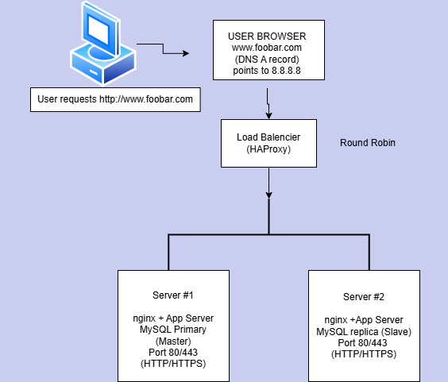

# Distributed Web Infrastructure

### *In this stage, we distribute our web infrastructure across multiple servers to improve **redundancy**, **availability**, and **scalability**. Here is the high‐level design:*

**Dijeont Jean-Paul**

## Key Point

**1\.  User Browser**

* The end user types `www.foobar.com` in their browser.
* DNS resolves `www.foobar.com` to `8.8.8.8` (the IP of the load balancer).

**2\.  Load Balancer (HAProxy)**

* Receives incoming traffic on HTTP (80) or HTTPS (443). 
* Distributes (load balances) requests to Server \#1 and Server \#2 using Round Robin (as shown in the diagram).

**3\. Server \#1**

* Runs Nginx (web server) \+ an Application Server (could be Node.js, Python/Flask, etc.).  
* Hosts the MySQL Primary (Master) database.
* Listens on port 80 (HTTP) or 443 (HTTPS) if SSL is configured.

**4\. Server \#2**

* Runs Nginx \+ Application Server as well.
* Hosts the MySQL Replica (Slave) database.  
* Also listens on port 80/443 for web/app traffic.

### Why We Added Each New Element

1. **Second Server (Server \#2)**  
   * In Task \#0, we had only one server hosting everything. That was a Single Point of Failure.  
   * By adding a second server, we can distribute traffic, reduce load on a single machine, and allow some redundancy.
2. **Load Balancer (HAProxy)**  
   * The load balancer sits in front of the two servers.
   * **Reason:**  
     * Distribute incoming requests to both servers (Server \#1 and Server \#2). 
     * Avoid overloading one machine. 
     * If one server fails or needs maintenance, the LB can direct traffic to the other server.  
3. **Database in Primary-Replica (Master-Slave) Setup**  
   * Splitting MySQL into a Primary (Master) and a Replica (Slave) helps offload read operations and provides partial redundancy. 
   * In some setups, your application can read from the Replica while writes are directed to the Primary.

---

### Load Balancer Algorithm & Setup

* **Algorithm:**  
  * We chose Round Robin in this example. It means the LB sends the first request to Server \#1, the next request to Server \#2, and so on, in a cycle.
* **Active-Active vs Active-Passive:**  
  * Active-Active: Both servers actively handle requests simultaneously.
  * Active-Passive: Only one server receives traffic; the other is on standby, ready to take over if the first fails.

**In this diagram, we’re assuming Active-Active so that both servers handle traffic in parallel.**

---

### Primary-Replica (Master-Slave) Database Explanation

1. **Primary (Master)**  
   * Handles all write operations (INSERT, UPDATE, DELETE). 
   * Typically also handles read operations, but we can offload reads to the Replica.
   * Replicates data to the Replica node in near real‐time.
2. **Replica (Slave)**  
   * Receives replicated data from the Master.  
   * Often configured as read‐only to avoid conflicts. 
   * Provides redundancy in case the Master fails (though you still need a failover process).

---

### Difference Between Primary and Replica from the Application Perspective

* **Primary:**  
  * The app sends write queries here. This is the authoritative source of truth for the data.  
* **Replica:**  
  * The app may send read queries here if your code is configured to do so, or simply use it as a hot standby in case the Master fails.

**If the Master goes down, you can promote the Replica to become the new Master, but this process might not be fully automatic unless you’ve set up additional tooling (e.g., orchestrators, proxy layers).**

---

### Issues with This Infrastructure

1. **Where Are the Single Points of Failure (SPOFs)?**  
   * The load balancer itself can be a SPOF if there’s only one LB process. 
   * The Master database node is still a SPOF for writes. If it goes down, you can’t write data until you promote the Replica.
2. **Security**  
   * No firewall shown, no mention of SSL certificates (unless you explicitly configure HTTPS). 
   * Data in transit might not be fully secured if you’re not using TLS.  
3. **No Monitoring**  
   * You can’t track server health or performance without a monitoring tool.  
   * If something breaks, you only find out when users complain.
