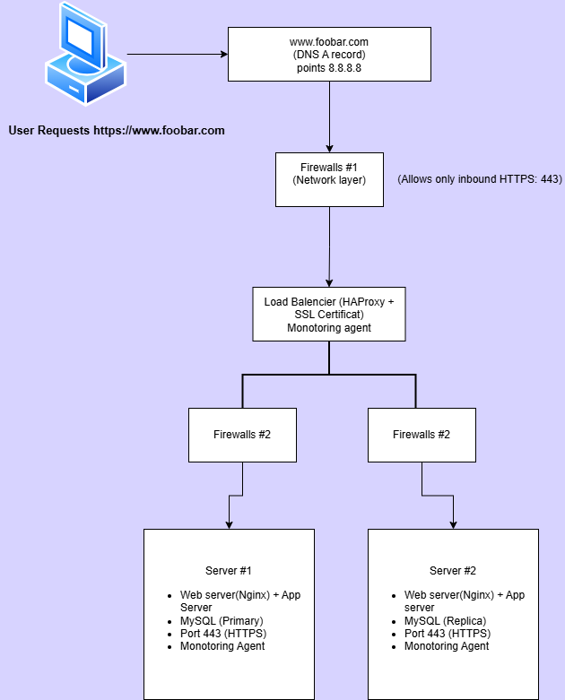

# Secured and Monitored Web Infrastructure

### *In this task, we need a **three‐server web infrastructure** that serves traffic securely (HTTPS) and is monitored. Below is a high‐level representation of the design, followed by the explanations of each component and the issues with this setup.Lorem ipsum dolor sit amet, consectetuer adipiscing elit*

**Dijeont Jean-Paul**

## Key Point

**Above, we see 3 servers:**

1. The Load Balancer server (HAProxy \+ SSL \+ Monitoring Agent). 
2. Server \#1 (Web server \+ App server \+ MySQL Primary \+ Monitoring Agent).  
3. Server \#2 (Web server \+ App server \+ MySQL Replica \+ Monitoring Agent).

**Additionally, we have 3 firewalls:**

* Firewall \#1 in front of the Load Balancer (network layer).  
* Firewall \#2 in front of Server \#1. 
* Firewall \#3 in front of Server \#2.

**We also have 3 monitoring clients (one on each server) and 1 SSL certificate on the load balancer to serve `https://www.foobar.com`.**

## **Explanation of Each Element**

### **1\. Firewalls (3 Total)**

* **Why?**  
  * Firewalls filter incoming and outgoing traffic.  
  * Each server (and the LB) is protected from unauthorized access. 
  * Firewall \#1 ensures only traffic on HTTPS port (443) reaches the load balancer from the public internet. 
  * Firewall \#2 and Firewall \#3 allow only specific ports from the LB to each server (e.g., port 443 for HTTPS traffic, port 3306 for database replication if needed).
* **What Are Firewalls For?**  
  * They prevent malicious access or unwanted connections.  
  * You can restrict ports/services to reduce the attack surface on each machine.

  ### **2\. SSL Certificate (HTTPS)**

* **Why Is the Traffic Served Over HTTPS?**  
  * HTTPS encrypts the connection between the user’s browser and the load balancer, ensuring data privacy and protection from eavesdropping.  
  * The certificate is installed on the load balancer, so all user traffic is secure up to that point (a common setup known as SSL termination).

  ### **3\. Monitoring**

* **3 Monitoring Clients**  
  * Monitoring Agent \#1 on the Load Balancer. 
  * Monitoring Agent \#2 on Server \#1.  
  * Monitoring Agent \#3 on Server \#2.  
* **What Is Monitoring Used For?**  
  * It collects metrics (CPU usage, memory, network traffic, application logs, etc.) and sends them to a monitoring service (e.g., DataDog, New Relic, Sumo Logic, etc.).  
  * **If something goes wrong (high load, memory leaks, services crash), alerts can be triggered.**  
* **How the Monitoring Tool Collects Data**  
  * Each agent runs locally on the machine, reading system metrics and logs, then sending them to a centralized platform.  
  * This can be done via APIs, secure connections, or custom protocols.  
* **Monitoring Web Server QPS**  
  * QPS (Queries Per Second or Requests Per Second) can be tracked by the agent hooking into the web server logs or metrics. 
  * The monitoring service can aggregate these logs and show how many requests hit the server per second, if any are failing, etc.

  ---

  ## **Main Issues with This Infrastructure**

**Even though this setup is more secure and monitored than previous tasks, there are still some drawbacks to address:**

1. **Terminating SSL at the Load Balancer**  
   * **Why is it an issue?**
     * Once the traffic is decrypted at the LB, the data might flow in plain HTTP to the back‐end servers.  
     * In a trusted private network, it’s often acceptable, but it can be a concern if your internal network is not fully secure.
     * You can solve it by re‐encrypting behind the LB or using end‐to‐end encryption.  
2. **Having Only One MySQL Server Capable of Accepting Writes**  
   * Why is it an issue?**  
     * If the primary (Master) goes down, you lose the ability to write new data.  
     * Promoting the Replica (Slave) to become the new Master requires manual or semi‐automated steps, causing downtime or potential data inconsistencies.  
3. **All Servers Having the Same Components (Database, Web Server, App)**  
   * **Why is this a problem?**  
     * Updates or maintenance on any server can impact multiple layers (web, app, DB) at once.  
     * Scaling each layer independently becomes more complicated (maybe you only need more web servers, but each is also running a DB). 
     * A single server can become a performance bottleneck if different components compete for resources.  
     * In more advanced setups, you’d split these roles onto different servers (e.g., a dedicated DB server, separate app servers, separate web servers).

   