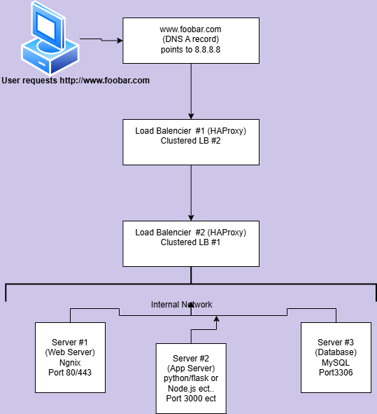

# Scale Up

## *In this final step, we scale up our infrastructure by adding an additional load balancer (HAProxy) in cluster mode and separating the web server, application server, and database onto **dedicated servers**. Below is the diagram and the explanation of why we added each new piece.t*

**Dijeont Jean-Paul**

## **What Changed from Previous Tasks?**

1. **New Load Balancer**  
   * We now have **two HAProxy nodes** in a cluster (LB \#1 and LB \#2).  
   * This removes the load balancer as a single point of failure. If LB \#1 fails, LB \#2 can still serve traffic (active-active or active-passive configuration).  
2. **Additional Server**  
   * We added a third server so that each layer is on its own machine:  
     * **Server \#1**: Web server only (Nginx).  
     * **Server \#2**: Application server only (Node.js, Python, etc.).  
     * **Server \#3**: Dedicated Database server (MySQL).  
   * Splitting the roles simplifies maintenance and improves scalability.

   ---

   ## **Why These New Elements?**

1. **Second Load Balancer (LB \#2)**  
   * **Reason**: Previously, one LB was a single point of failure. By adding a second LB in a cluster, we ensure high availability.  
   * **Cluster**: Could be set up as **active-active** (both handle traffic) or **active-passive** (one is standby, the other is primary). Tools like Keepalived or VRRP can provide a virtual IP that floats between the two LBs.  
2. **Third Server** (so you have Web, App, DB separated)  
   * **Reason**: “Splitting components” ensures each server focuses on one role, which makes scaling each layer easier:  
     * If you receive a large number of static requests, you can add more web servers (like Server \#1).  
     * If your back‐end logic becomes the bottleneck, you can add more application servers (like Server \#2).  
     * If the database is overloaded, you can scale the DB layer independently (like Server \#3).  
   * **Maintenance**: Updating or restarting the web layer doesn’t directly affect the application or database.

   ---

   ## **Specifics About This Infrastructure**

1. **Application Server vs Web Server**  
   * **Web Server (Nginx)**:  
     * Handles HTTP/HTTPS requests directly from the load balancers.  
     * Serves static files (images, HTML, CSS).  
     * Passes dynamic requests to the application server if needed.  
   * **Application Server (Node.js, Python/Flask, etc.)**:  
     * Contains the business logic.  
     * Communicates with the database to process data.  
     * Listens on a port (e.g., 3000\) that the web server or load balancers connect to.  
2. **Database Server**  
   * **MySQL** (port 3306).  
   * Fully dedicated to data storage.  
   * Improves performance, because the database no longer competes with the web or application processes on the same box.  
3. **High Availability & Scalability**  
   * The load balancer tier is now **redundant** (two LB nodes).  
   * The back‐end is **split** so each layer can be scaled independently.  
