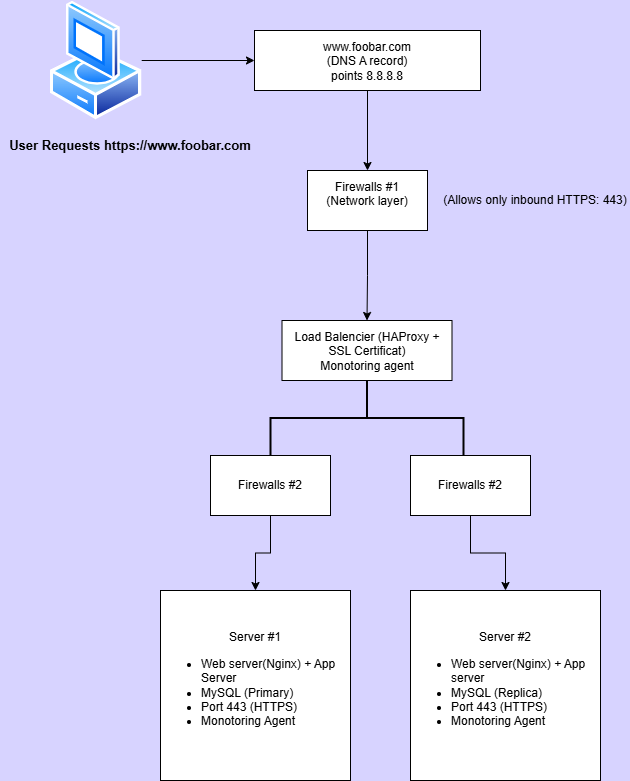
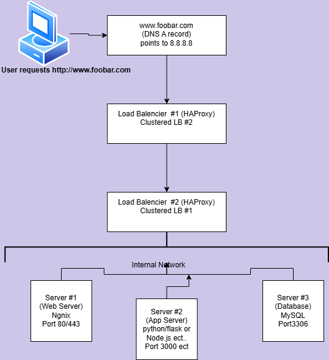

# Web Infrastructure Design
### Description

**This project focuses on designing and understanding web infrastructure. By completing the tasks, you will gain insights into the following concepts:**

    Network Basics
    Servers
    Web Servers
    DNS
    Load Balancers
    Monitoring

The project will progressively build from a simple single-server setup to a more robust, secure, and scalable web infrastructure.
## Learning Objectives

**At the end of this project, you should be able to explain to anyone:**

    General Concepts:
        Draw a diagram of the web stack you built during this project.
        Explain the purpose of each component in the stack.
        Describe system redundancy and how to achieve it.
        Understand key acronyms: LAMP, SPOF, QPS.
    Specific Knowledge:
        Differences between a web server and an application server.
        Types of DNS records (A, CNAME, MX, TXT).
        Avoiding downtime during deployments.
        High availability clusters (Active-Active vs. Active-Passive).
        The importance of HTTPS and firewalls.

## Resources
Read or Watch:

    Network Basics
    What is a Server?
    Web Server Concepts
    DNS Records and Types
    Load Balancers
    Monitoring Tools
    What is a Database?
    Single Point of Failure (SPOF)
    Avoiding Downtime During Deployments
    High Availability Clusters
    What is HTTPS?
    What is a Firewall?

## Tasks
**Task \.0: Simple Web Stack**

    Objective: Design a one-server web infrastructure.
    Requirements:
        Use a single server with:
            Web server (Nginx).
            Application server.
            Database (MySQL).
            Domain name: www.foobar.com.
        DNS A record points to server IP (8.8.8.8).
        Explain:
            What is a server?
            Role of the domain name.
            Type of DNS record used.
            Roles of web server, application server, and database.
            Communication process between the server and the user’s computer.
        Identify issues:
            SPOF.
            Downtime during maintenance.
            Inability to scale under heavy traffic.

**Task \.1: Distributed Web Infrastructure**

    Objective: Design a three-server web infrastructure.
    Requirements:
        Add:
            2 additional servers (total 3).
            Load Balancer (HAProxy).
            Database in Primary-Replica (Master-Slave) mode.
        Explain:
            Role of each additional element.
            Load Balancer’s distribution algorithm (e.g., Round Robin).
            Active-Active vs. Active-Passive setup for the Load Balancer.
            How the Primary-Replica cluster works.
            Differences between Primary and Replica.
        Identify issues:
            SPOFs.
            Security issues (no HTTPS, no firewalls).
            No monitoring in place.

**Task \. 2: Secured and Monitored Web Infrastructure**

    Objective: Enhance the previous infrastructure with security and monitoring.
    Requirements:
        Add:
            3 firewalls.
            SSL Certificate to serve HTTPS traffic.
            3 monitoring clients (one on each server).
        Explain:
            Purpose of each added element (firewalls, SSL, monitoring tools).
            Why HTTPS is important.
            How monitoring collects data.
            How to monitor web server QPS.
        Identify issues:
            Why SSL termination at the Load Balancer is problematic.
            Single point of failure in the MySQL Primary server.
            Challenges with all servers having the same components (web/app/db).

**Task \. 3: Scale Up**

    Objective: Scale up the infrastructure by adding a clustered load balancer and splitting components.
    Requirements:
        Add:
            1 additional server.
            1 additional load balancer in a clustered setup.
        Split the components:
            Web server (Nginx) on one server.
            Application server (Python/Node.js) on another server.
            Database server (MySQL) on a separate machine.
        Explain:
            Why each new element was added.
            Differences between web servers and application servers.

## How to Submit

    Diagrams:
        Create a diagram for each task using software (Draw.io).
        Save the diagrams as images in the images/ folder.
    Answer Files:
        For each task, provide a link to your diagram in the respective answer file.
        Push your files to the GitHub repository: https://github.com/Weebaay/holbertonschool-system_engineering-devops/tree/main/web_infrastructure_design
    Review:
        Request a manual QA review when all tasks are completed.

Issues to Address in Future Improvements

    SPOF in MySQL:
        A single primary database is still a point of failure. A more robust solution would involve database clustering or automated failover.

    Monitoring:
        Ensure alerts are properly configured to detect failures in real time.

    End-to-End Encryption:
        Terminating SSL at the load balancer is sufficient in trusted networks, but re-encrypting traffic between the LB and back-end servers would add an extra layer of security.

    Scalability:
        In high-traffic scenarios, more web, app, or database servers may need to be added to handle the load.

## Conclusion

**This project teaches the fundamental concepts of web infrastructure design and deployment. By completing the tasks, we’ve progressively built from a simple, single-server setup to a distributed, secured, and scalable architecture. The focus has been on redundancy, security, monitoring, and scalability—all critical aspects of modern web systems.**

## Author

**Jean-Paul Dijeont**