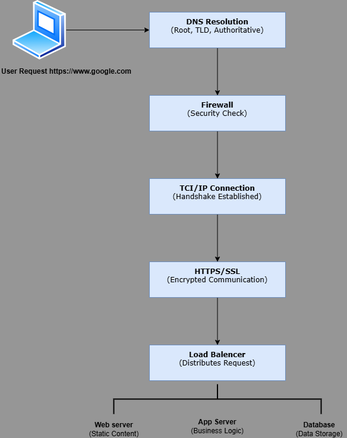

# Task: Add a Schema to Illustrate the Flow of a Web Request

## **Overview**

In this task, I have created a schema to illustrate the flow of the request when a user types `https://www.google.com` in their browser and presses Enter. The goal of this schema is to visually explain the journey of the request from the browser to the database and back, highlighting all the key steps and components involved.

The diagram provides a clear representation of the following elements:

1. **DNS Resolution**: Translating the domain name (`www.google.com`) into an IP address.
2. **Request Hitting the Server on the Appropriate Port**: Connecting to the server using the IP address and port.
3. **Traffic Encryption**: Ensuring the communication is encrypted via HTTPS/TLS.
4. **Firewall**: Filtering the traffic to ensure security.
5. **Load Balancer**: Distributing the request to one of the available servers.
6. **Web Server**: Handling static files and forwarding dynamic requests.
7. **Application Server**: Generating the requested web page.
8. **Database**: Retrieving the necessary data for the application server.

---

## **Diagram**

Below is the schema I created to represent the flow of the request:

---

## **Tools Used**

For creating the diagram, I used **Diagram.io (Draw.io)**, which is a free and user-friendly tool for creating professional diagrams. It allowed me to structure the flow logically and visually represent the key components of the request journey.

---

## **Conclusion**

This schema provides a clear visual representation of the flow of a web request from the browser to the database and back. It highlights the key technologies and processes involved, such as DNS resolution, encryption, firewalls, load balancing, and server interactions. By understanding this process, we can appreciate the complexity and efficiency of modern web infrastructure.
